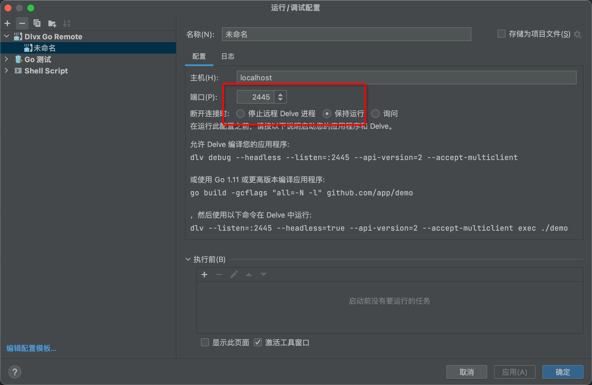
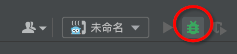

# go-zero 后端api项目开发基础脚手架


## 技术架构
1. 框架  [go-zero官方](https://github.com/zeromicro/go-zero)
2. 采用docker-compose 进行容器管理
3. 数据库: mysql

4. 数据库驱动: go-zero 提供了一个强大的 sqlx 工具
5. redis 采用pika [pika_redis](https://github.com/OpenAtomFoundation/pika)
6. 消息队列: go-zero 提供了一个强大的 [go-queue](https://go-zero.dev/docs/tasks/queue/message-queue) 工具
7. api验证请求字段是否合法:

   [validator](https://github.com/go-playground/validator)
   https://pkg.go.dev/github.com/go-playground/validator/v10

8. goctl模板修改:
9. debug调试
10. [modd 热重载](github.com/cortesi/modd/cmd/modd)
   方便修改代码后自动执行构建,在docker中运行,修改业务代码时自动加载,直接进行调试 
11. casdoor 单点登录系统集成


## 功能
### docker-compose
1. 本地 docker-compose 环境区分  
   具有环境的 docker-compose.yml,根据 .env 区分不同容器名的前缀区分,在本地开发时避免因为一些常用
   容器名被占用而无法启动容器
2. mysql
   以下两种都在[docker-compose_template.yml](docker-compose_template.yml)文件中存在
   第一种:采用ssh隧道连接远程
   第二种:本地docker数据库
3. 模板配置文件[docker-compose_template.yml](docker-compose_template.yml) 中也有本地mysql方式
4. nginx 配置文件 [nginx_app.conf](deploy/nginx/conf.d/nginx_app.conf)
   作为反向代理
### goctl 自动生成代码脚本
1. [根据api生成代码的脚本](deploy/script)
2. [根据数据库生成代码的脚本](deploy/script)
3. [goctl模板文件的重写](deploy/goctl)
4. [goctl工具使用官方master的版本二进制文件](deploy/goctl/1.6.2/goctl)
    goctl 这是在 go-zero 官方git master版本中的,1.6.2, (1.6.1 生成api时的引入公共文件时报错找不到包,例如公共api文件 api/desc/page/page.api)
### casdoor 单点登录, casdoor 负责维护用户的登录状态 (默认)
    配置文件在 [goZeroDashboardBase.yaml](app%2Fusercenter%2Fcmd%2Fapi%2Fetc%2FgoZeroDashboardBase.yaml)
### 常规登录 用户名密码登录 (需要改动如下)
    配置文件在 [goZeroDashboardBase.yaml](app%2Fusercenter%2Fcmd%2Fapi%2Fetc%2FgoZeroDashboardBase.yaml)
邮箱+秘密+图片验证码
不包含rbac权限管理,如果需要权限管理,请自行添加,需要做以下步骤
1. [修改加密盐值 可选](app/usercenter/cmd/api/etc)
#app/usercenter/cmd/api/etc 目录下的 ymal 文件 slat 值全局搜索修改
2. api修改
注释掉casdoor的代码,打开常规登录代码
[user.api](app%2Fusercenter%2Fcmd%2Fapi%2Fdesc%2Fuser%2Fuser.api)
3. 修改 [serviceContext.go](app%2Fusercenter%2Fcmd%2Fapi%2Finternal%2Fsvc%2FserviceContext.go)文件
4. 执行生成api的shell文件 [genApi.sh](deploy%2Fscript%2Fgencode%2FgenApi%2FgenApi.sh)
```shell
# 注意先进入目录!
cd deploy/script/gencode/genApi/genApi.sh
./genApi.sh
```
### 相关工具代码
1. rsa加密是一个非对称 加密算法，使用公钥加密，私钥解密。 [查看用法](common/utils/rsa2)
2. [随机数,随机字符串 生成](common/utils/krand_test.go)
3. [其他加密](common/utils/encryption.go)
4. [验证码](common/utils/captcha.go)
5. [trc20 钱包生成](common/utils/walletCreate)
 


## 环境配置
### 配置文件
[.envtpl](.envtpl) 复制为 .env 文件,可以修改里面的配置
```shell
cp .envtpl .env
```
[docker-compose_template.yml](docker-compose_template.yml)文件中存在
```shell
cp docker-compose_template.yml docker-compose.yml
```
### 导入数据库
将sql文件导入到数据库,默认采用ssh连接远程数据库,也可以在
[导入数据库](deploy/sql)

    常规登录方式测试账户
    test123@163.com
    123123

### 启动
后台运行
```shell
docker-compose up -d
```
前台运行
```shell
docker-compose up
```


## debug 

[dlv goland 调试工具](https://github.com/go-delve/delve/tree/master/Documentation/installation)
开启debug后先运行一下,再进行api请求




## 目录结构介绍
```text
├── Dockerfile
├── README.md
├── app
│   └── usercenter  区分业务模块,如果后面随着业务发展有多个业务模块,可以创建多个目录
│       ├── cmd  主程序
│       │   └── api 这是业务模块的api,单独拆出来一个文件夹方便后面如果增加rpc服务,在同级目录下创建rpc文件夹即可
│       │       ├── desc  这是业务模块的api描述文件
│       │       ├── etc   这是业务模块的配置文件
│       │       │   └── ****.yaml  这是业务模块的配置文件
│       │       ├── ***.go  这是业务模块的入口文件
│       │       └── internal  这是业务模块的内部文件
│       │           ├── common  internal内部使用的公共方法
│       │           ├── config  这里定义配置文件中的结构体 etc 目录下.yaml文件需要什么就在这里写定义
│       │           ├── handler  这是业务模块的handler 自动生成
│       │           ├── logic 这里定义业务模块的业务逻辑 自动生成后写具体的业务逻辑
│       │           ├── svc  这里定义业务模块的service,model,redis,rpc等logic需要什么就在这里写定义
│       │           └── types 这是自动生成
│       └── model 存放model文件
│           ├── userModel_gen.go
│           └── vars.go
├── common
│   ├── constants 全局常量
│   │   └── dbConstants.go
│   ├── core
│   │   ├── gorm.go
│   │   └── redis.go
│   ├── errorx  
│   │   ├── baseerror.go
│   │   └── errormsg.go
│   ├── globalkey 全局变量
│   │   └── core.go
│   ├── response  
│   │   └── response.go
│   └── utils 工具包
├── deploy
│   ├── sql 基础框架需要的sql文件
│   ├── goctl
│   │   ├── 1.6.2 goctl修改版本
│   │   └── 1.6.2_offical goctl官方版本
│   ├── pika pika redis 
│   ├── nginx 
│   │   └── conf.d
│   │       └── nginx_app.conf nginx配置文件,如果有多个路由前缀记得修改这里
│   └── script
│       ├── genMysql
│       │   └── genModel.sh 生成model的脚本
│       └── gencode
│           ├── gen.sh
│           └── genApi  
│               └── genApi.sh 生成api的脚本
├── docker-compose-dev.yml
├── docker-compose.yml
├── entrypoint.sh
├── go.mod
└── modd.conf

```


## 参考
[go-zero官方](https://github.com/zeromicro/go-zero)  
[后台管理系统 ark-admin-zero](https://github.com/arklnk/ark-admin-zero)
1. 登陆验证码,登录创建缓存
2. 退出登陆
3. api请求结构体中的验证插件 , 验证写法
[民宿系统 go-zero-looklook](https://github.com/Mikaelemmmm/go-zero-looklook)
1. 模板文件
2. shell 生成api model文件脚本


## 如果想替换成自己的项目名
先替换全局替换 go_zero_dashboard_base 为自己要创建的项目名
```shell
#替换所有文件中包含的 go_zero_dashboard_base 为自己的,注意最好用下划线,api中的service命名有要求!
#替换所有文件中包含的 GoZeroDashboardBase 为自己的,注意大小写!!!
#替换所有文件中包含的 goZeroDashboardBase 为自己的,注意大小写!!!
#查找 goZeroDashboardBase.yaml 改为自己的项目名文件
go mod tidy
```

## todo 
### 文件整理
#### jwt中间件文件关系待整理,可以正常使用
[middleware](app%2Fusercenter%2Fcmd%2Fapi%2Finternal%2Fmiddleware)
下面的两个文件在 [user.api](app%2Fusercenter%2Fcmd%2Fapi%2Fdesc%2Fuser%2Fuser.api) 中定义的中间件是     middleware: CustomJwtHandle
在 [serviceContext.go](app%2Fusercenter%2Fcmd%2Fapi%2Finternal%2Fsvc%2FserviceContext.go) 文件中
```go
return &ServiceContext{
		Config:          c,
		Redis:           redisClient,
		UserModel:       model.NewUserModel(mysqlConn, c.Cache),
		CasdoorClient:   casdoorClient,
		CustomJwtHandle: jwtHandle.Handle,
	}
```
[authMiddleware.go](app%2Fusercenter%2Fcmd%2Fapi%2Finternal%2Fmiddleware%2FauthMiddleware.go)
[customjwthandleMiddleware.go](app%2Fusercenter%2Fcmd%2Fapi%2Finternal%2Fmiddleware%2FcustomjwthandleMiddleware.go)